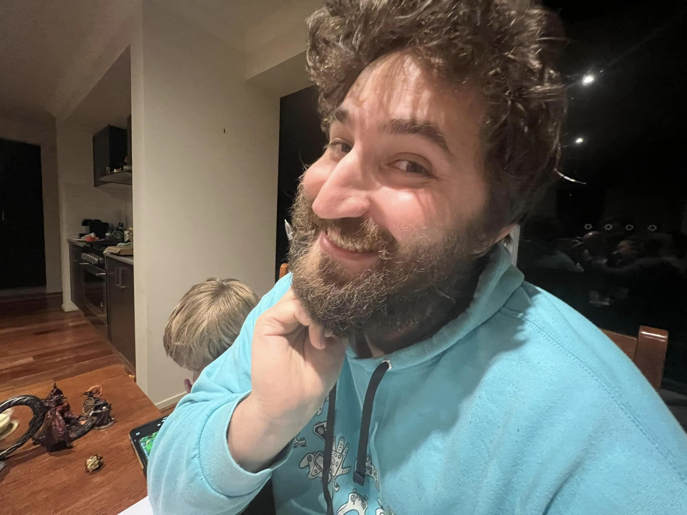

# Welcome

This is my creative place. Most of it is Valkair, a Norse-inspired homebrew campaign wiki for Pathfinder 2e.

## Start here

- [[World Overview]]
- [[The Middens]]
- [[Hammerfall]]
- [[The Guild]]
- [[The Pact]]

## What this site holds

World lore. Session notes. Characters. Places. Factions. The moving parts of the campaign, kept in one place so the table can follow the shape of the world as it changes.

## About me

I build things mostly with Go and AWS-native tools. I am interested in APIs, services, ttrpgs, and collaborative side projects.

## Contact

- LinkedIn: [williamvk](https://www.linkedin.com/in/williamvk/)
- X: [@willyvank](https://twitter.com/willyvank)
